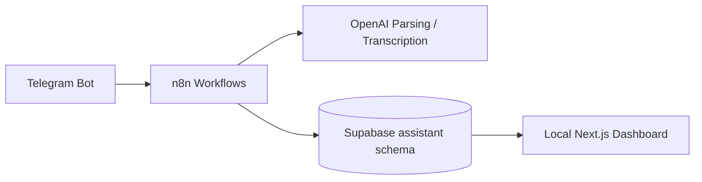

# Project Handoff: n8n Personal Assistant

## Project Name

n8n Personal Assistant

## Goal

A Telegram-based personal assistant for tracking expenses, tasks, reminders, receipts, summaries, and later AI memory/agents/dashboard.

## Current Architecture



## Current Data Store

Supabase project:

`uxdueryjbfzfvyznxgax`

Main schema:

`assistant`

Important tables:

- `assistant.expenses`
- `assistant.tasks`
- `assistant.logs`
- `assistant.pending_actions`
- `assistant.preferences`
- `assistant.recurring_expenses`
- `assistant.recurring_tasks`
- `assistant.memories`
- `assistant.weekly_reviews`

## How To Continue

When opening this project again, start by reading:

1. `README.md`
2. `docs/personal-assistant-phase-status.md`
3. `docs/n8n-personal-assistant-pending-phases.md`

Then check:

```powershell
n8n list:workflow --active=true
Invoke-RestMethod -Uri 'http://127.0.0.1:5678/healthz'
```

If n8n is not running:

```powershell
& 'C:\Users\Admin\Documents\Codex\2026-05-14\i-want-to-start-a-small\start-n8n-with-ngrok.ps1'
```

